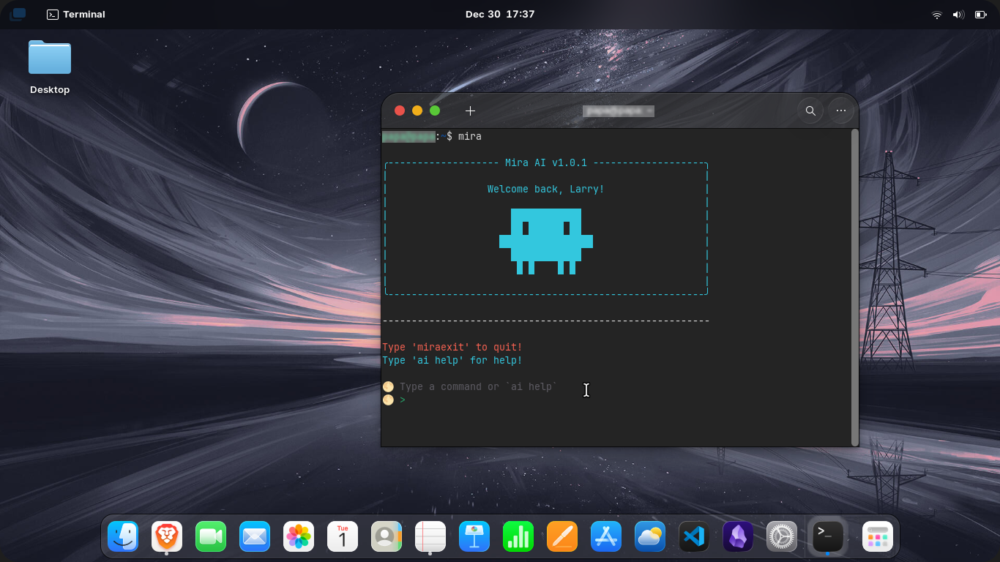

# 🌕 Mira AI

Mira AI is a lightweight Python CLI assistant that runs your shell commands — but with a twist! It also supports special `ai` commands so you can interact with it directly. Think of Mira as Claude, but free and open source — a handy AI helper right in your terminal.


*Basic usage of MiraAI.*

```bash
> ai greet
Mira AI: Hello! How can I assist you today?

> ls -la
(total directory listing output)

> miraexit
Mira AI: Exiting Mira AI. Goodbye!
```

## Installation

To install Mira AI, clone or download the repository, then run the install.sh script:

```bash
bash install.sh
```

This will:

- Make mira.py executable
- Copy it to ~/bin/mira
- Add ~/bin to your PATH if it’s not already there

After installation, reload your terminal environment:

```bash
source ~/.bashrc
```

Now you can run mira from anywhere!

> **Heads up!**
> Make sure you run install.sh from the repo root folder so it can find mira.py.

## Usage

Just type `mira` in your terminal and start typing commands or AI prompts!

- Use `ai greet` or `ai help` to interact with Mira’s built-in AI commands.
- Run normal shell commands as usual.
- Type miraexit to quit.

## Uninstalling Mira AI

If you want to uninstall, simply run:

```bash
bash remove.sh
```

This will:

- Remove mira from ~/bin
- Remove the PATH modification from your .bashrc (if added by install script)

Remember to reload your shell afterwards:

```bash
source ~/.bashrc
```

## Extending Mira AI

You can easily add new AI commands by editing `mira.py`. Look for the section that handles commands starting with `ai` and add your custom logic.
